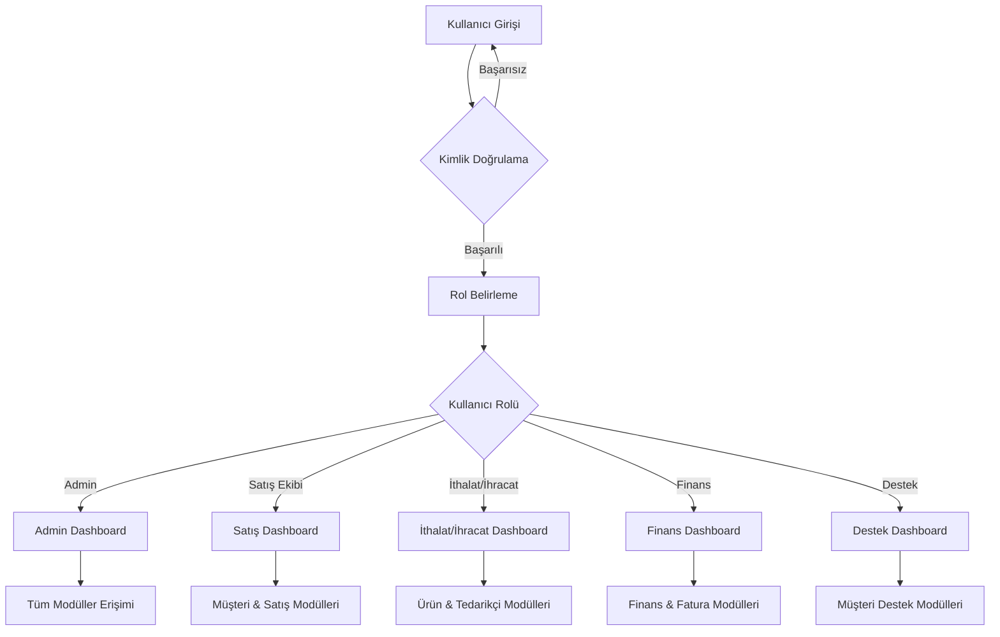
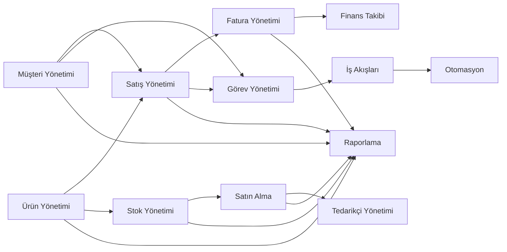
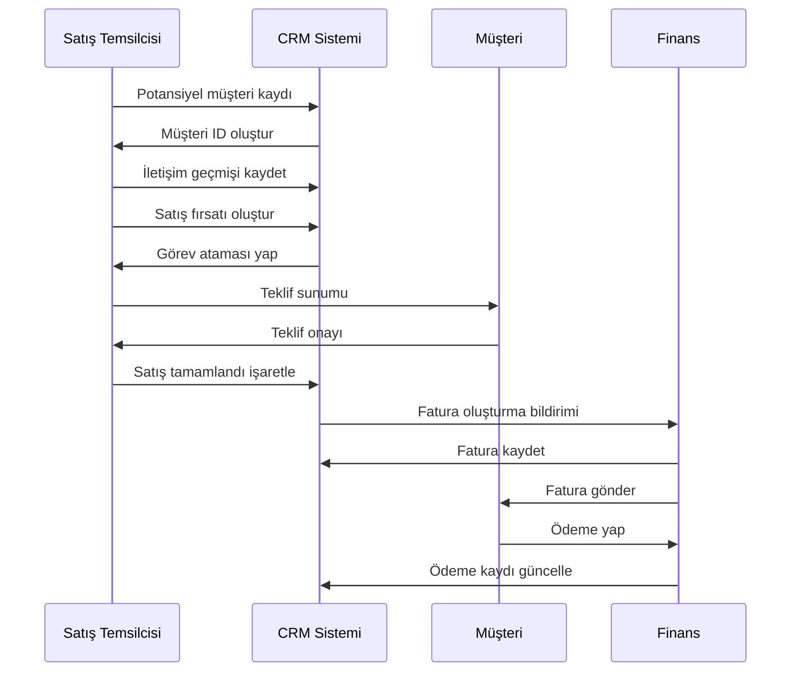
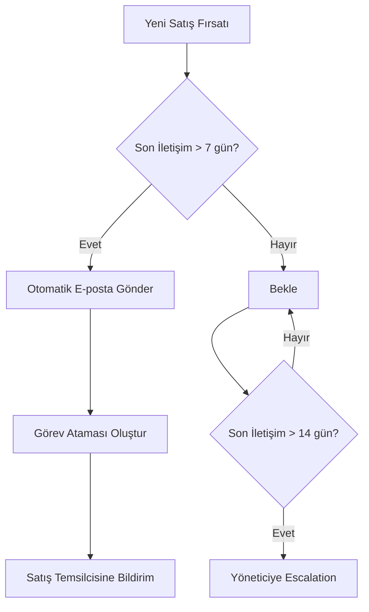
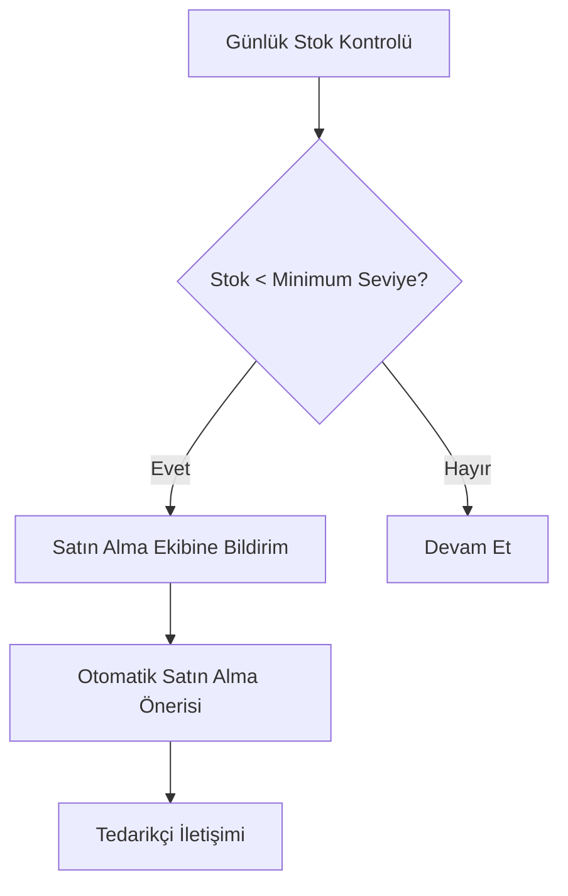
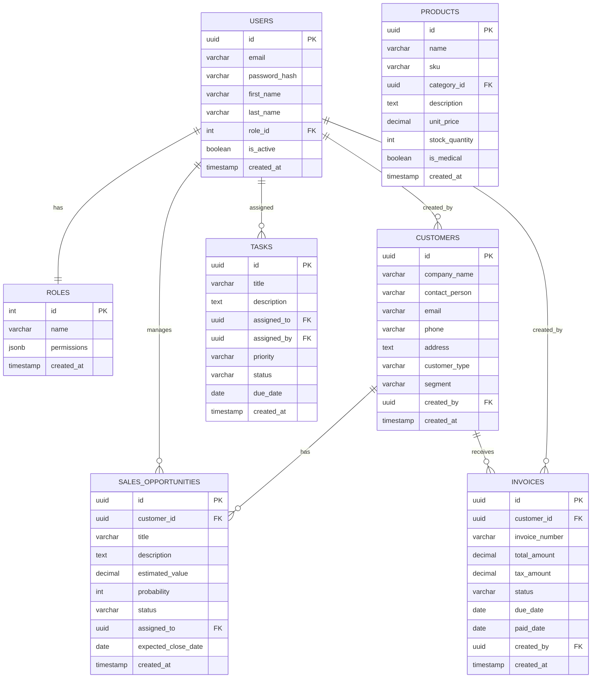
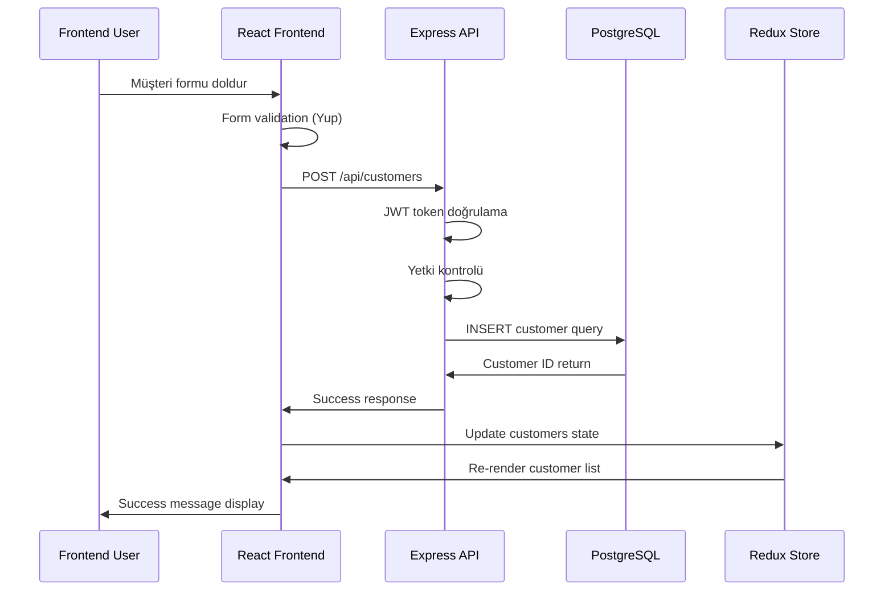
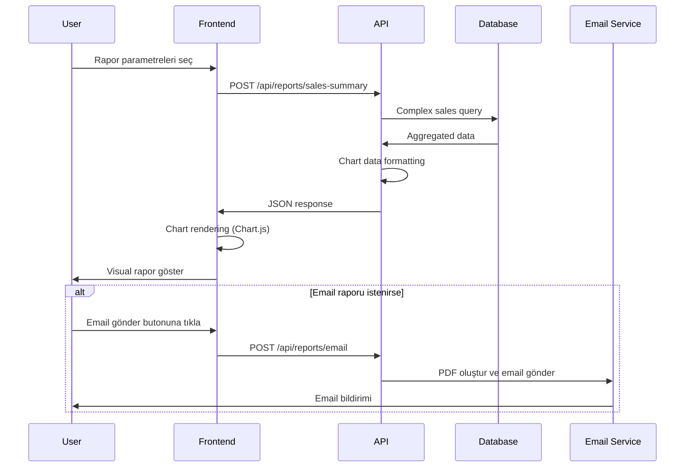
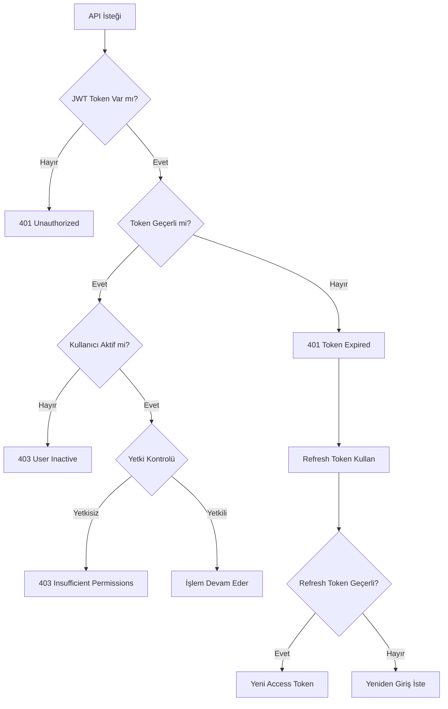

# Blabmarket CRM Sistem Akış Diyagramı

## Ana Sistem Akışı

## CRM Modülleri İlişki Diyagramı

## Müşteri Yaşam Döngüsü

## İş Akışı Otomasyon Örnekleri

### Satış Fırsatı Takibi

### Stok Uyarı Sistemi

## Veritabanı İlişki Diyagramı

## API İstek Akış Örnekleri

### Müşteri Oluşturma İşlemi

### Satış Raporu Oluşturma

## Güvenlik Akış Diyagramı

Bu diyagramlar sistemin tüm akışlarını ve modüller arası ilişkileri net bir şekilde göstermektedir. Geliştirme süreci boyunca bu akışlara uygun şekilde kod yazılacaktır.